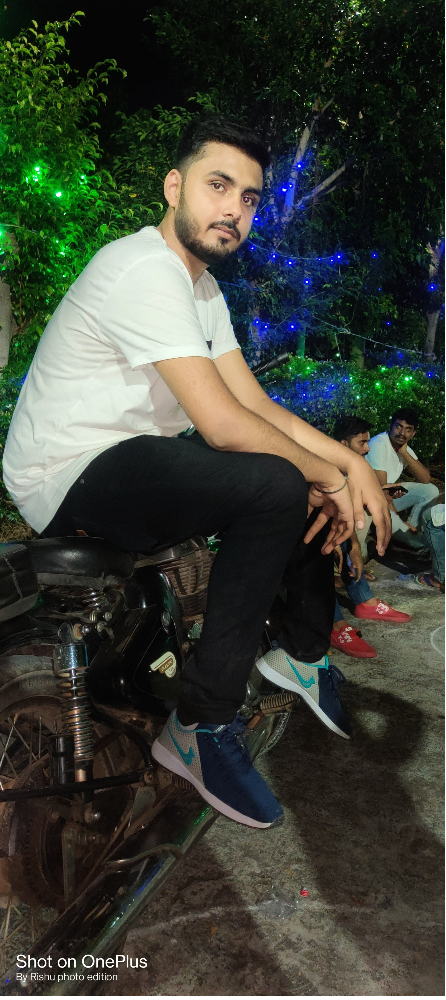

# HTML-Projects
<!DOCTYPE html>
<html lang="en">
<head>
    <meta charset="UTF-8">
    <meta name="viewport" content="width=device-width, initial-scale=1.0">
    <title>Kunal Resume</title>
</head>
<body>
    

        

            <h1>Kunal Resume</h1>
            
Contact:<a href="kunalabhijit290301@gmail.com">Kunalabhijit290301@gmail.com</a>

            
LinkedIn:<a href="https://www.linkedin.com/in/kunal-abhijit-b4a4ba1b9">https://www.linkedin.com/in/kunal-abhijit-b4a4ba1b9</a>

            
Github:<a href="https://github.com/abhijitsinghkunal">https://github.com/abhijitsinghkunal</a>

            <table>
                <tr>
                    <td>
                        
                    </td>
                    <td> I am a passionate front end developer with expertise in problem solving and algorithmic thinking.I love to explore various technologies and framework to develop efficient & scalable solutions.With a strong foundatio s in datastructure & algorithms,I strive to robust and optimized code.I am constantly expanding my skills and staying up-to-date with the latest advancements in the field of software development.</td>
                </tr>
            </table>
            <section>
                <h2>Education</h2>

                <ul>
                    <li>
                        Bachelor of technology in electrical Engineering,Government Engineering College,Nawada
                    </li>
                    <li>10 th,12th ;ST PAIUL'S SCHOOL ,BEGUSARAI</li>
                </ul>
            </section>
            <section>
                <h2>
                    Skills
                </h2>
                <ul>
                    <li>Java</li>
                    <li>C++
                    </li>
                    <li>Python</li>
                    <li>HTML</li>
                    <li>Javascript</li>
                    <li>SQL</li>
                    <li>DBMS</li>
                </ul>

            </section>
            <section>
                <h2>Achivements</h2>
                <ul>
                    <li>
                        Service Selection board
                    </li>
                    <li>
                        Published an article on Automatic speech recognisation Using DNN
                    </li>
                </ul>
            </section>
            <Section>
                <h2>Projects</h2>
                <ul>
                    <li>Student Information system
                    
                    </li>
                    <li>Automatic Speech Recognisation using DNN</li>
                    <li>Automatic street light using LDR</li>
                </ul>

            </Section>
            <footer>2023_abhijitsinghkunal.All Rights Reserved</footer>

        

    

    
</body>
</html>
